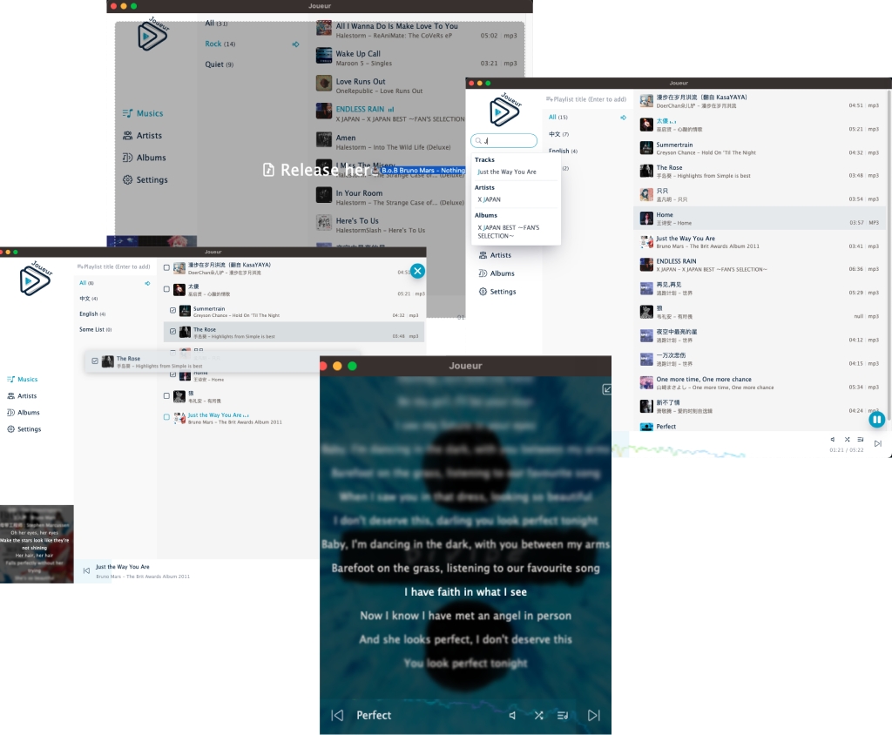

<h1 align="center">
   
 
   
  Joueur
   
   
</h1>

A tiny and playful music player

  

## Download

[Releases](https://github.com/Blackman99/joueur/releases)

## Features & TODOs

  
Features & TODOs

* [x] Drag & Drop files
* [x] Rust audio parser
* [x] Basic DB 
* [x] Playlist & Artist & Album grouping
* [ ] Playlist
  * [x] Create
  * [ ] Update 
    * [ ] Add songs
      * [x] By dragging from file system
      * [x] By dragging single song from inside lists
      * [x] By dragging multi-selected songs from inside lists
      * [ ] By context menu single
      * [ ] By context menu multi-selected songs
    * [x] Remove Song
      * [x] Remove single by context menu
      * [x] Remove multi-selected songs by context menu
  * [x] Delete by context menu
* [ ] Now playing List
  * [ ] Songs resort by dragging 
  * [x] Remove single song by context menu
  * [ ] Add single song from other list by context menu
* [x] Player core
  * [x] Play & Pause
  * [x] Next & Prev
  * [x] Volume
  * [x] Modes: list cycle, single, shuffle
  * [x] Progress bar click & drag
  * [x] Spectrum
* [x] Search
  * [x] Global search song/artist/album
* [ ] Lyrics
  * [x] Basic display
  * [x] Auto scroll
  * [x] Edit
  * [x] Update by directly edit
* [ ] View
  * [x] List view
  * [ ] Table view
  * [x] Grid view
  * [x] Virtual scroll
  * [x] Zen/Full screen Mode 
* [ ] Dark mode
* [ ] I18n
* [ ] Theme color toggle

## Contributing

See [Contributing](./CONTRIBUTING.md)

## LICENSE

[MIT](./LICENSE)