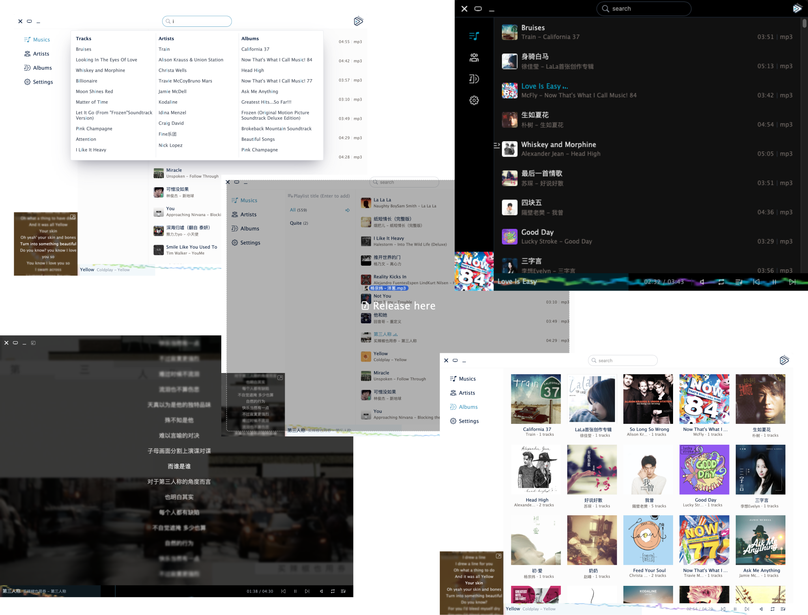

<h1 align="center">
   
 
   
  Joueur
   
   
</h1>

A logical music player you've always wanted

  

## TODO

* [x] Drag & Drop files
* [x] Rust audio parser
* [x] Basic DB 
* [x] Playlist & Artist & Album grouping
* [ ] Playlist
  * [x] Create
  * [ ] Update 
    * [ ] Add songs
      * [x] By dragging from file system
      * [x] By dragging single song from inside lists
      * [ ] By dragging multi-selected songs from inside lists
      * [ ] By context menu single
      * [ ] By context menu multi-selected songs
  * [ ] Delete Songs 
    * [ ] By context menu
  * [ ] Delete 
  * [ ] Now playing list resort by dragging
* [ ] Player
  * [x] Play & Pause
  * [x] Next & Prev
  * [x] Volume
  * [ ] Modes: list cycle, single, shuffle
  * [x] Progress bar click & drag
  * [ ] Spectrum
* [ ] Search
  * [ ] Global search song/artist/album
  * [ ] Specify category search
* [ ] Lyrics display
* [ ] Virtual scroll
* [x] List View
* [ ] Table view
* [ ] Grid view
* [ ] Dark mode
* [ ] I18n
* [ ] Toggle with different theming color
* [ ] Smooth animation
